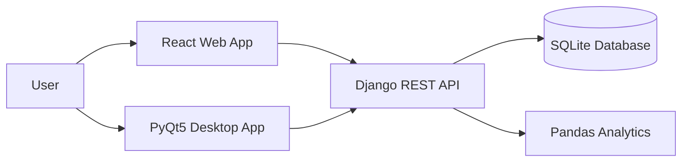

<div align="center">
  
  <h1>Chemical Equipment Parameter Visualizer</h1>

  <p>
    <strong>A hybrid web + desktop analytics platform for chemical engineering data.</strong>
  </p>

  <p>
    <a href="https://github.com/bold24-AY/chemical-equipment-visualizer/blob/main/LICENSE">
      
    </a>
    
    
    
  </p>
</div>

---

## 📖 Overview

The **Chemical Equipment Visualizer** is a dual-interface application designed to streamline the analysis of equipment parameter data. Whether you prefer a modern **React Web Dashboard** or a native **PyQt5 Desktop Application**, this tool provides a unified backend to upload CSV data, visualize key metrics (flowrate, pressure, temperature), and generate PDF reports.

### ✨ Key Features

*   **📊 Interactive Dashboards**: Visualize data with dynamic Bar and Pie charts (Chart.js & Matplotlib).
*   **📑 Automatic Reporting**: Generate downloadable PDF reports with detailed statistics.
*   **💾 Smart Data Persistence**: Automatically manages storage, keeping only the last 5 uploads per user.
*   **🔒 Secure Multi-Tenancy**: Session-based authentication ensures users see only their isolated data.
*   **🚀 Hybrid Architecture**: Single Django REST Framework backend serving both Web and Desktop clients.

---

## ⚡ Quick Start

Get the system running in minutes.

### 1. Backend Setup (Django)

The heart of the application. Run this first.

```bash
cd backend
python -m venv venv
# Windows
venv\Scripts\activate
# macOS/Linux
source venv/bin/activate

pip install -r requirements.txt
python manage.py migrate
python manage.py createsuperuser # Optional: Create admin
python manage.py runserver
```
> Backend runs at `http://127.0.0.1:8000`

### 2. Web Frontend (React)

For the browser-based experience.

```bash
cd web-frontend
npm install
npm start
```
> Web App opens at `http://localhost:3000`

### 3. Desktop App (PyQt5)

For the native desktop experience.

```bash
cd desktop-app
pip install -r requirements.txt
python main.py
```

---

## 🏗️ Architecture



*   **Single Source of Truth**: Django backend manages all logic and data.
*   **Portable Database**: SQLite implementation allows for easy deployment and testing.
*   **Powerful Analytics**: Pandas processes CSV data for accurate statistical insights.

---

## 💻 Usage Guide

### Authentication
*   **Register**: Create a new account directly in the app.
*   **Demo Credentials**:
    *   **Username**: `trial12`
    *   **Password**: `Trial@1234`

### CSV Data Format
Your Upload CSV **must** follow this strict format (Case-Sensitive):

```csv
Equipment Name,Type,Flowrate,Pressure,Temperature
Pump A,Pump,120.5,5.2,65
Reactor B,Reactor,300.0,15.8,450
```

> **Note**: Columns must be exactly as shown. No units in headers.

---

## 🔌 API Reference

| Endpoint | Method | Description |
| :--- | :--- | :--- |
| `/api/register/` | `POST` | Create a new user account |
| `/api/login/` | `POST` | Authenticate session |
| `/api/upload/` | `POST` | Upload and process CSV file |
| `/api/summary/` | `GET` | Retrieve latest dataset stats |
| `/api/history/` | `GET` | List last 5 uploads |
| `/api/report/` | `GET` | Download PDF report |

---

## 🐛 Troubleshooting

| Issue | Solution |
| :--- | :--- |
| `ModuleNotFoundError` | Ensure `venv` is active and `pip install -r requirements.txt` ran successfully. |
| `Axios Error` / `Connection Refused` | Confirm Django backend is running on port 8000. |
| `OperationalError: no such table` | Run `python manage.py migrate` to initialize the database. |

---

## 📄 License

This project is licensed under the **MIT License**. See the [LICENSE](LICENSE) file for details.

<div align="center">
  <sub>Built with ❤️ by the Chemical Equipment Visualizer Team</sub>
</div>
